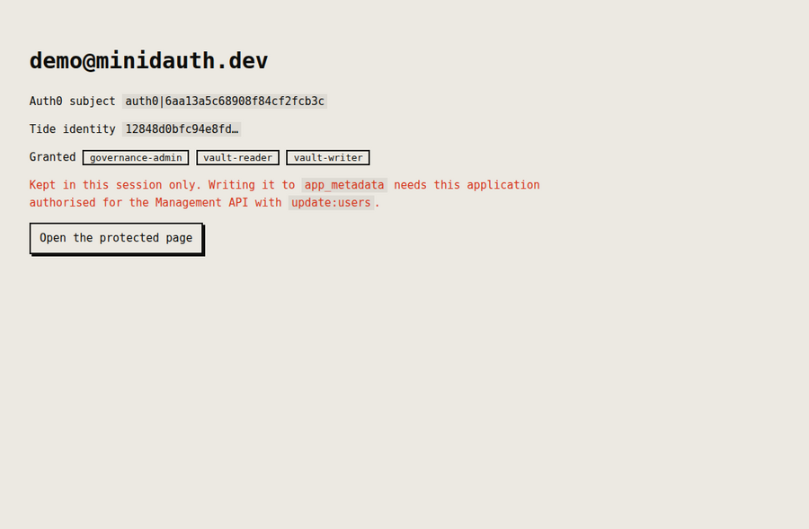
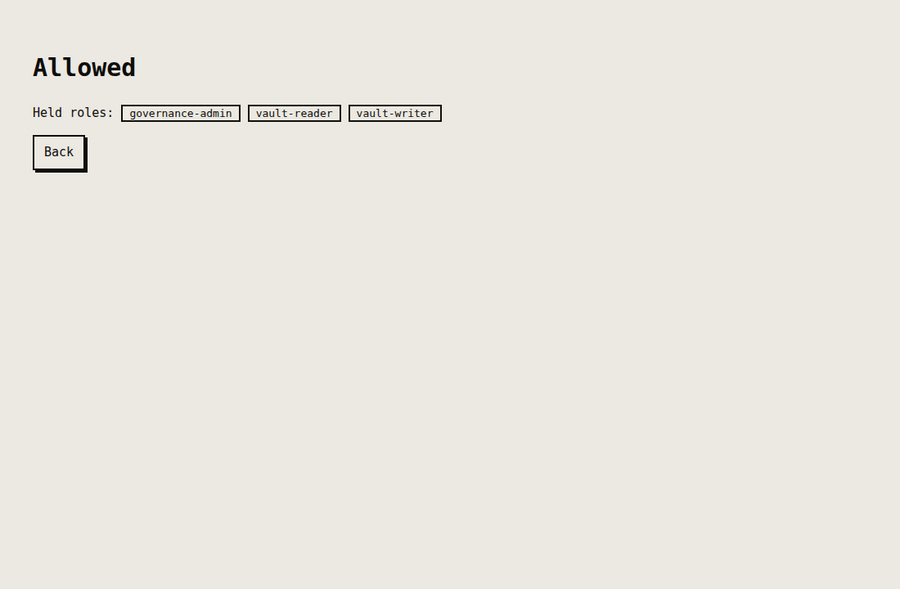

# minidauth with Auth0

Auth0 owns the login. minidauth supplies an identity the Tide network vouches for and roles a quorum
decides. The Auth0 token never carries a role, and that is the point.

## What it looks like

Recorded against a real Auth0 tenant and the public Tide network.

**Linked, and carrying roles.** Auth0 proved who the user is; the roles came from minidauth's grant
record. The red line is the honest bit, explained below.



**The protected page.** Allowed, because the grant record says so.



## Run it

In Auth0, create a **Regular Web Application** and set its allowed callback URL to
`http://localhost:3002/callback`. Then authorise that same application for the **Management API**
with the `update:users` scope, so it can write the link back.

Register this app's Tide callback with minidauth, which merges rather than replaces:

```sh
MINIDAUTH_OPS_TOKEN=<ops token> APP_URL=http://localhost:3002 \
  node ../shared/register-callback.js
```

Then:

```sh
npm install
export AUTH0_DOMAIN=your-tenant.au.auth0.com
export AUTH0_CLIENT_ID=...
export AUTH0_CLIENT_SECRET=...
export MINIDAUTH_TOKEN=dev-sample-app-token
npm start                                   # http://localhost:3002
```

## Where the link is stored, and why

`app_metadata.tide_vuid`, not `user_metadata`, because the user must not be able to edit it.

Roles stay out of Auth0 entirely. An Action can copy `app_metadata` into a token, and a role that
arrives in a token your tenant can mint is a role your tenant can grant itself, which is the single
point of failure this is meant to remove. `/protected` reads roles from minidauth on every request
instead.

## If the vuid will not persist

Writing `app_metadata` needs this application authorised for the Management API with `update:users`,
which is easy to miss because Auth0's newer **API Access** tab splits two different things:

| | |
|---|---|
| User-delegated Access | tokens issued for a signed-in user. Not what this uses |
| **Client Access** | machine to machine, which is what `client_credentials` needs |

A tenant can show "All permissions granted" against the first while the second reads
`0 / 273 permissions granted`. Click **Edit** on the Auth0 Management API row and grant
`update:users` under Client Access.

The example does not fail without it. The sign-in completes, the link lives in the session, and the
page says so, because a demo that dies on a permission the reader has not granted yet is a bad demo.

## Status

Run against a real Auth0 tenant and the public Tide network: sign up through Universal Login, link a
Tide identity, and a protected page that reads its answer from the grant record. Persisting the vuid
to `app_metadata` is the one part not exercised, for the reason above.
