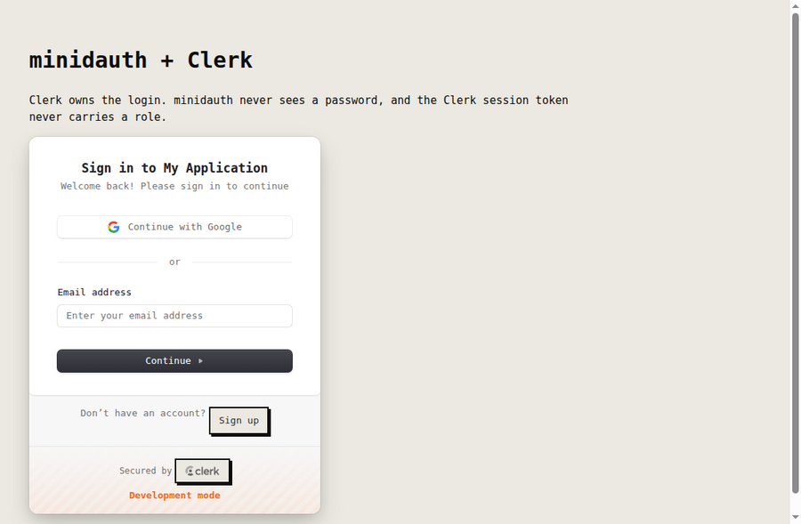
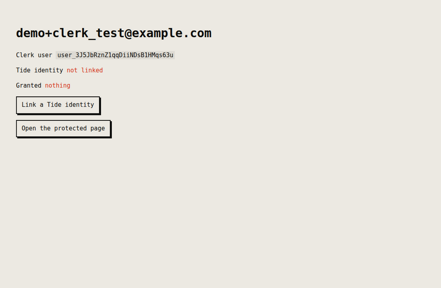
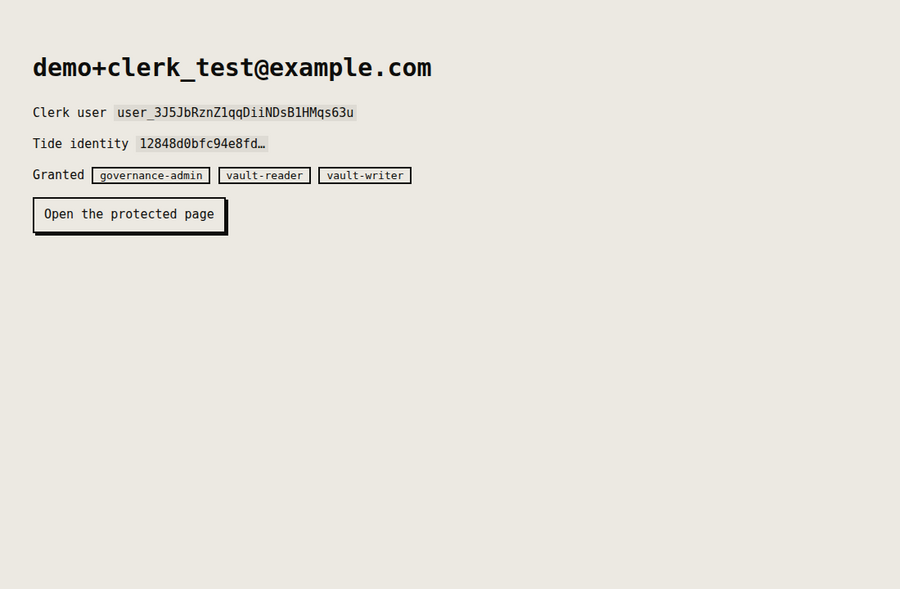
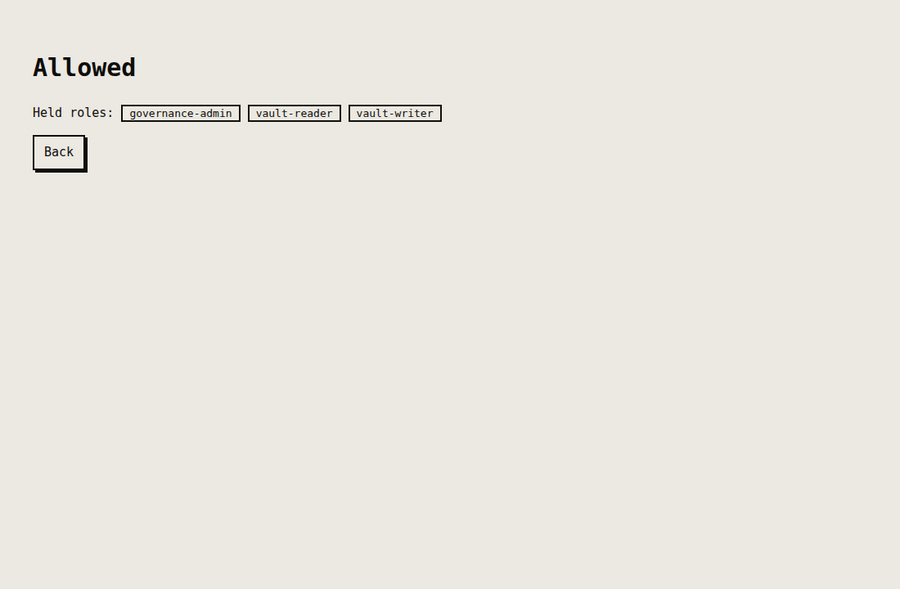

# minidauth with Clerk

Clerk owns the login, including the sign-in component. minidauth supplies an identity the Tide
network vouches for and roles a quorum decides.

## What it looks like

Recorded against a real Clerk application and the public Tide network.

**1. Clerk's own sign-in.** Mounted straight from Clerk, so nothing about authentication changes.



**2. Signed in, no Tide identity yet.** Authentication has happened. There is nothing to authorise
against, and the protected page turns you away.



**3. Linked, and carrying roles.** The password for the Tide identity was typed into a page served by
the ORK network, which neither this app nor minidauth can see. The roles came from the grant record,
not from anything in Clerk.



**4. The protected page.** Allowed, because the grant record says so.



## Run it

In Clerk, create an application and take both keys. Then register this app's Tide callback with
minidauth, which merges rather than replaces:

```sh
MINIDAUTH_OPS_TOKEN=<ops token> APP_URL=http://localhost:3003 \
  node ../shared/register-callback.js
```

```sh
npm install
export CLERK_PUBLISHABLE_KEY=pk_test_...
export CLERK_SECRET_KEY=sk_test_...
export MINIDAUTH_TOKEN=dev-sample-app-token
npm start                                   # http://localhost:3003
```

The sign-in is Clerk's own mounted component, so this example has no login form of its own. That is
the point: nothing about authentication changes.

## Where the link is stored, and why

`privateMetadata.tideVuid`, not `publicMetadata`, because the browser should not be able to read or
write it.

Roles stay out of Clerk. Metadata can be put into a session token, and a role in a token this app
can mint is a role this app can grant itself. `/protected` reads roles from minidauth on every
request instead.

## One thing Clerk needs that the others do not

The enclave returns by a cross site navigation, and on a Clerk **development** instance
`authenticateRequest` cannot identify the caller on one: the dev browser token is not carried, and it
answers `dev-browser-missing`. Asking the login provider who is returning is the fragile part of any
of these integrations, so this example does not. It sets its own short lived `tide_link` cookie when
the link starts and reads that on the way back.

That is worth copying even where the provider would have coped. The cookie is the app's own,
`httpOnly` and `SameSite=Lax`, so it survives exactly the navigation it needs to and nothing else.

## Status

Run end to end against a real Clerk application and the public Tide network: sign in, link, and a
protected page that reads its answer from the grant record. The screenshots above are that run.


## Tideless: encrypt & decrypt with no Tide account

This example also mounts a **tideless** page at `/tideless` (see
[`../shared/tideless.js`](../shared/tideless.js)). It is the opposite of linking a Tide identity: the
signed-in Clerk user encrypts and decrypts with **no Tide account and no doken**. Their own
the Clerk user id is the subject, and a role a quorum granted that id is the gate; minidauth issues the
vouchers and the ORK cohort does the crypto. The browser holds no credential — the server proxies
the vouchers and sets the uid from its own verified session, so a page cannot read as another user.

Two prerequisites, both one-time:

- minidauth must have a **PUBLIC** decrypt policy (voucher-gated, not doken-gated). A key's decrypt
  policy is either PUBLIC or PRIVATE, so this is a different key/policy from the account-linked flow
  above. See [docs/running.md](../../docs/running.md).
- Grant the user's id a role as a tideless subject, through the quorum:

  ```sh
  curl -sX POST localhost:8081/iga/change-requests/role -H "Authorization: Bearer $ALICE" \
    -H 'Content-Type: application/json' -d '{"vuid":"<clerk user id>","role":"vault-reader","tideless":true}'
  # $BOB and $CAROL authorize, then commit
  ```

Then sign in and open `/tideless`. The trade this makes — minidauth becomes the authority for these
users' reads — is spelled out in [examples/tideless](../tideless#the-trade-you-are-making).
