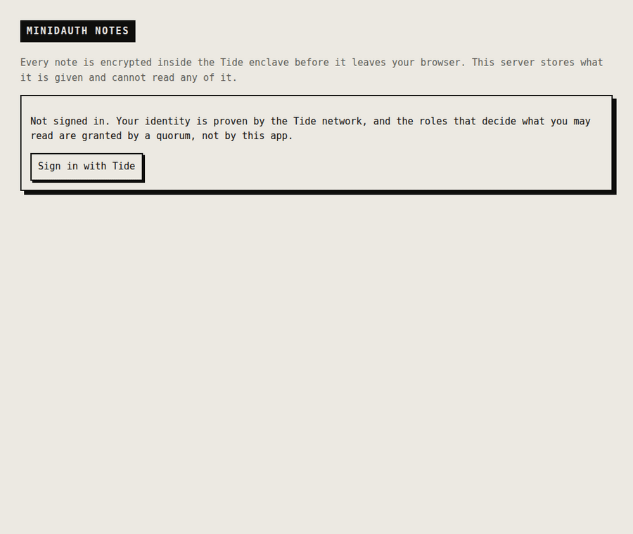

# minidauth notes

The demo that shows what minidauth is for. Encryption is the part you can see, but it is not the
point on its own.



Five frames, five different things, none of which this app decides for itself:

| | |
|---|---|
| **No password here** | There is no user table and no login form. Identity is proven by the Tide network. |
| **The enclave** | The password is typed into a page served by the ORKs. Neither this app nor minidauth ever sees it. |
| **Roles arrive from a quorum** | `vault-reader` was granted by administrators approving in their own enclaves, and the network signed the attestations that make it real. This app cannot grant itself anything. |
| **The database holds ciphertext** | Encrypted inside the enclave before it left the browser. The bottom panel is the file this server writes, printed verbatim. |
| **Reading is permission, not capability** | Decryption happens under a policy the ORKs enforce. Without the role they refuse, and nothing this app asks changes that. |

Behind all of it, and invisible in any screenshot: every token, policy and role grant here was signed
jointly by a threshold of independent nodes. Nothing was signed on this machine, which is why owning
this machine does not let you forge a role or mint a token the network will accept.

> **A stolen copy of the database contains nothing readable, and no key to make it readable.**

## What each part is proving

**The note is encrypted where you type it.** `public/index.html` sends the plaintext to the enclave,
a page served by the ORK network, and gets ciphertext back. The plaintext never reaches this server.

**The server cannot read what it stores.** `/api/notes` takes a string and writes it down. There is
no decrypt path in `server.js` at all, and adding one would not help: decryption happens inside the
enclave under a policy the network enforces.

**Reading is decided by a quorum, not by the app.** Decrypting runs under a PRIVATE policy gated on
`vault-reader`. Without that role the ORKs refuse, and nothing this app does changes the answer.
Granting the role takes administrator approvals in their own enclaves.

**Identity comes from the network too.** There is no password here and no user table. Signing in
proves a Tide identity, and the vuid that comes back is one minidauth verified rather than one this
app decided to believe.

## Run it

minidauth needs to be running with its policies deployed, and this app's callback registered:

```sh
MINIDAUTH_OPS_TOKEN=<ops token> APP_URL=http://localhost:3005 \
  node ../shared/register-callback.js

npm install
npm start                                    # http://localhost:3005
```

The enclave has to be able to fetch a voucher from minidauth, which a browser will not allow against
a loopback address. Run minidauth with `docker compose --profile public up`, or set
`MC_VOUCHER_PUBLIC_URL` to an address the browser will accept.

| | |
|---|---|
| `MINIDAUTH_URL` | `http://localhost:8081` |
| `MINIDAUTH_TOKEN` | a `relying-party` token |
| `APP_URL` | `http://localhost:3005` |

## Try breaking it

**Read the database.** `cat notes.json`, or open the panel at the bottom of the page. Ciphertext.

**Take the server.** There is nothing in this process to steal. No key, and no code path that reads
a note.

**Grant yourself the role.** Editing anything here does nothing: the roles come from minidauth's
grant record, and changing that needs approvals the ORKs check.

## Status

Run end to end against the public Tide network. The screenshot is that run: a real note, encrypted
under a deployed policy, stored, and decrypted back through one gated on a role.
