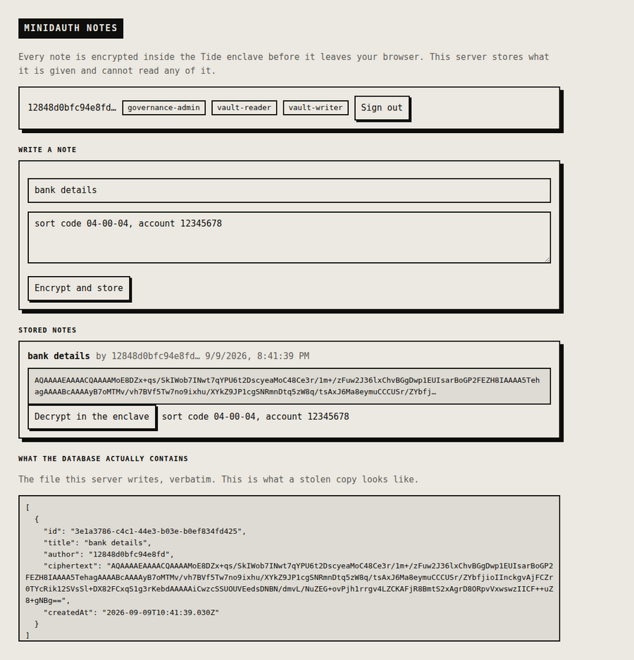

# minidauth notes

The demo that shows what minidauth is actually for.

Write a note. It is encrypted inside the Tide enclave before it leaves your browser, and this server
stores what it is handed. The server has no key, holds no key, and cannot be persuaded to read a
note, because the decision is not its to make.



Look at the bottom panel. That is the file this server writes, printed verbatim. **That is what a
stolen copy of the database contains**, and there is no key anywhere in the system that would turn
it back into text on its own.

## What each part is proving

**The note is encrypted where you type it.** `public/index.html` sends the plaintext to the enclave,
a page served by the ORK network, and gets ciphertext back. The plaintext never reaches this server.

**The server cannot read what it stores.** `/api/notes` takes a string and writes it down. There is
no decrypt path in `server.js` at all, and adding one would not help: decryption happens inside the
enclave under a policy the network enforces.

**Reading is decided by a quorum, not by the app.** Decrypting runs under a PRIVATE policy gated on
`vault-reader`. Without that role the ORKs refuse, and nothing this app does changes the answer.
Granting the role takes administrator approvals in their own enclaves.

**Identity comes from the network too.** There is no password here and no user table. Signing in
proves a Tide identity, and the vuid that comes back is one minidauth verified rather than one this
app decided to believe.

## Run it

minidauth needs to be running with its policies deployed, and this app's callback registered:

```sh
MINIDAUTH_OPS_TOKEN=<ops token> APP_URL=http://localhost:3005 \
  node ../shared/register-callback.js

npm install
npm start                                    # http://localhost:3005
```

The enclave has to be able to fetch a voucher from minidauth, which a browser will not allow against
a loopback address. Run minidauth with `docker compose --profile public up`, or set
`MC_VOUCHER_PUBLIC_URL` to an address the browser will accept.

| | |
|---|---|
| `MINIDAUTH_URL` | `http://localhost:8081` |
| `MINIDAUTH_TOKEN` | a `relying-party` token |
| `APP_URL` | `http://localhost:3005` |

## Try breaking it

**Read the database.** `cat notes.json`, or open the panel at the bottom of the page. Ciphertext.

**Take the server.** There is nothing in this process to steal. No key, and no code path that reads
a note.

**Grant yourself the role.** Editing anything here does nothing: the roles come from minidauth's
grant record, and changing that needs approvals the ORKs check.

## Status

Run end to end against the public Tide network. The screenshot is that run: a real note, encrypted
under a deployed policy, stored, and decrypted back through one gated on a role.
