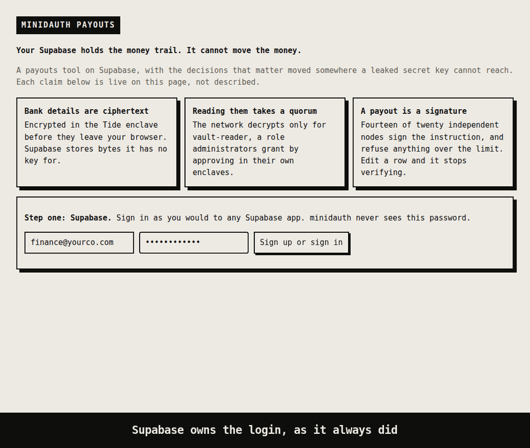
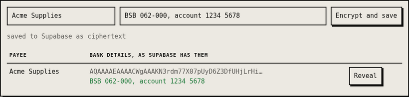
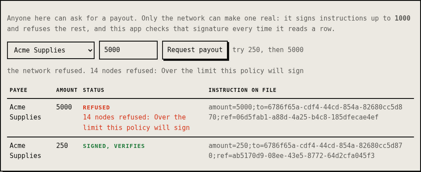
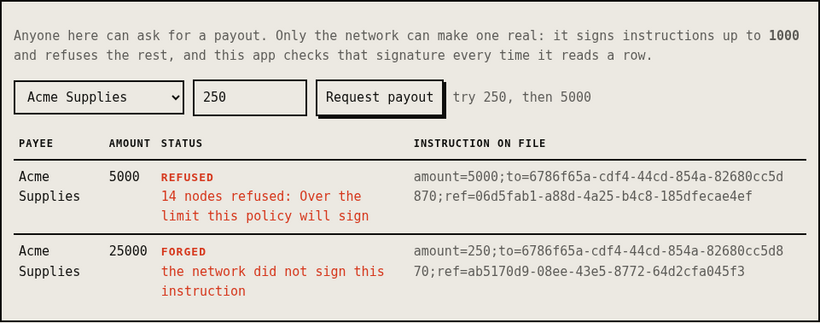

# minidauth payouts

**Your Supabase holds the money trail. It cannot move the money.**



A payouts tool built the way most Supabase apps are: Supabase for sign-in, Postgres for the data, a
small server holding the secret key. Then it asks what that key is worth to somebody who steals it,
and moves the answer to the Tide network.

| If somebody has your Supabase secret key, they can | Here |
|---|---|
| Read every payee's bank details | Ciphertext. Encrypted in the Tide enclave before it left the browser. |
| Grant themselves the role that reads them | Roles are not in Supabase. Granting one takes an admin approving in their own enclave. |
| Mark a payout as approved | The row can say anything. A payout is real only if the network signed it, and this app checks. |
| Change the amount on an approved payout | The signature stops verifying. Nobody without a quorum can make a new one. |
| Approve a payout over the limit | Fourteen independent nodes read the instruction and refuse. |

Supabase keeps doing what it is good at. Nothing here replaces your login, your database or your
row level security. It takes three decisions out of reach of everything you run, including this
server.

## How it works

**Two sign-ins, on purpose.** Supabase says who you are to this app. Tide proves the identity the
network will act for. The first time, that Tide identity is linked to your Supabase user through
`app_metadata`, which only the secret key can write. After that, unlocking with a different Tide
identity is refused.

**Bank details.** The browser hands them to the Tide enclave, a page served by the ORK network, and
gets ciphertext back. The server stores that in `payees.bank_ciphertext`. There is no decrypt path in
[`server.js`](server.js), and adding one would not help: **Reveal** asks the network, which decrypts
only for identities holding `vault-reader`.



**Payouts.** A request creates a pending row and an instruction built from it:

```
amount=250;to=<payee id>;ref=<payout id>
```

**Ask the network** sends that instruction to the cohort under the payment policy. Its contract reads
the amount before anyone signs, and signs up to the limit or refuses. The signature comes back to the
server, which checks it before letting the row say `signed`.



That refusal is not this app choosing to behave. Each node ran the contract on its own and said no,
so there is no signature, and without one there is no payout, only a row that failed to become one.

**Checked on every read, not trusted once.** [`verify.js`](verify.js) rebuilds the instruction from
the row as it stands and checks the signature against the vendor public key. That is plain Ed25519
and about twenty lines of Node, so an auditor or a bank can do the same check with nothing from Tide.
The payout's own id is in the instruction, so a signature cannot be moved onto a different payout
for the same amount.

Here a signed 250 was changed to 25000 in Supabase, the way anyone holding the secret key could:



The instruction on file still says 250, and editing that too would not help. The check rebuilds the
instruction from the row itself, and the network only ever signed 250.

## Run it

You need minidauth running with a vendor key and its policies deployed, which the
[quick start](../../README.md#quick-start) covers.

**1. Supabase.** Create a project at [supabase.com](https://supabase.com) (free tier, no card). From
**Project Settings → API** take the URL, the publishable key and the secret key. Turn **email
confirmations** off under Authentication → Providers → Email, or sign-up waits for an email.

**2. The tables.** Open the SQL Editor, paste [`schema.sql`](schema.sql) and click Run. Row level
security is on with no policies, so only the server can reach the tables.

**3. Register the callback** with minidauth. This merges into the existing list:

```sh
MINIDAUTH_OPS_TOKEN=<ops token> APP_URL=http://localhost:3006 \
  node ../shared/register-callback.js
```

**4. Start it.**

```sh
cat > .env <<'EOF'
SUPABASE_URL=https://<project>.supabase.co
SUPABASE_ANON_KEY=<publishable key>
SUPABASE_SERVICE_ROLE_KEY=<secret key>
MINIDAUTH_URL=http://localhost:8081
MINIDAUTH_TOKEN=<relying-party token>
APP_URL=http://localhost:3006
EOF
npm install
npm start                                    # http://localhost:3006
```

The enclave fetches a voucher from minidauth, which browsers will not allow against a loopback
address. Run minidauth with `docker compose --profile public up`, or set `MC_VOUCHER_PUBLIC_URL`.

## Try breaking it

**Read the database.** Section 3 of the page is both tables exactly as the secret key returns them.
So is the Supabase Table Editor.

**Edit a signed payout.** Change its amount in the Table Editor and reload. It turns **forged**.

**Grant yourself the role.** There is nothing in Supabase to edit. Roles come from minidauth's grant
record, and changing that takes approvals the network checks.

**Go over the limit.** Request 5000 and ask the network. Fourteen nodes refuse it, each on its own.

## Giving somebody a role

In minidauth, never in Supabase. That is the point: nothing in Supabase can grant one, so neither can
anybody holding its key.

A new teammate signs in and links their Tide identity. Until they hold `vault-reader`, **Reveal**
refuses. Hover their Tide id on the page for the full vuid, then file the grant:

```sh
curl -X POST http://localhost:8081/iga/change-requests/role \
  -H "Authorization: Bearer <operator token>" -H "Content-Type: application/json" \
  -d '{"vuid":"<their vuid>","role":"vault-reader"}'
```

Or use the form in the [minidauth console](http://localhost:8081/console), which does the same thing.
Then, under change requests: **Approve** until the operator count is met, **Sign in enclave** as an
administrator, which is the approval the network counts, and **Commit**.

On commit the role is real, and the page shows it on the next load because it asks on every
request. The enclave acts on the token from sign-in, though, so the teammate signs out and unlocks
again to carry it. Revoking works the same way.

## What the network decides, and what this app decides

Worth being exact about, because the difference is the point.

| | Decided by |
|---|---|
| Who may read bank details | The network: the decrypt policy requires `vault-reader` |
| Who holds `vault-reader` | The network: role grants need an admin approving in their enclave |
| Whether an instruction is signed | The network: the payment contract refuses anything over the limit |
| Whether a stored payout is genuine | Anyone with the public key, via the signature |
| Who may request a payout, or ask for a signature | This app. Any unlocked member can ask; the network decides the answer |

That last row is honest rather than ideal. The payment policy here checks the instruction, not who
is asking. A policy that also required an approver role, or two of them, is the same kind of
contract and the natural next step.

## Status

Run end to end against the public Tide network and a real Supabase project, and recorded above in
that order: sign-in through Supabase, a Tide identity linked through the enclave, bank details
encrypted and revealed, a 250 payout signed and verified in Node, a 5000 payout refused by fourteen
nodes, and a signed row edited in Supabase turning forged.
