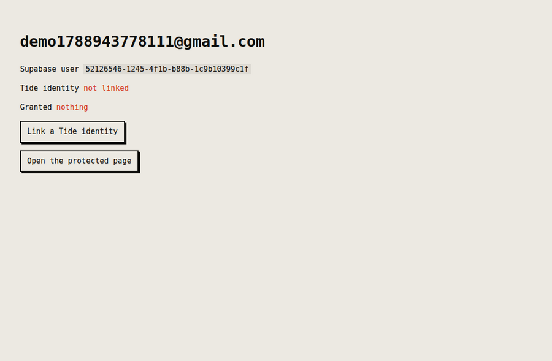
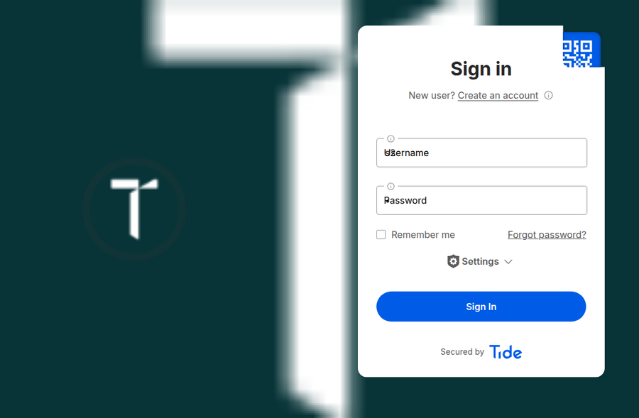
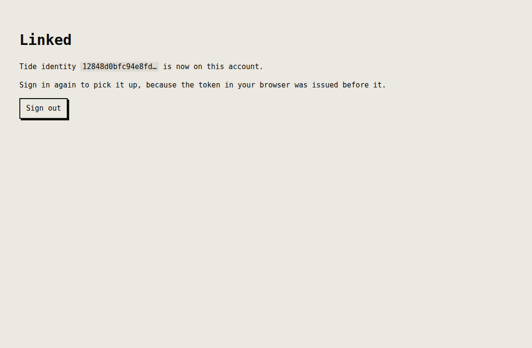
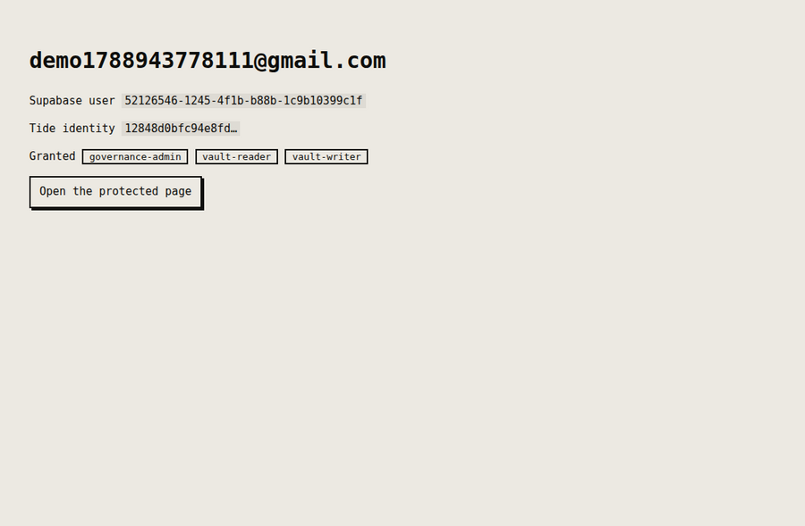
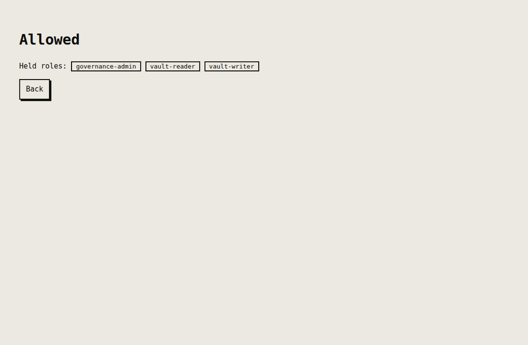

# minidauth with Supabase

Supabase owns the login. minidauth supplies an identity the Tide network vouches for and roles a
quorum decides. Free tier, no card.

## What it looks like

Recorded against a real Supabase project and the public Tide network, in that order.

**1. Signed in with Supabase, no Tide identity yet.** Authentication has already happened. There is
nothing to authorise against.



**2. Linking goes to the Tide enclave.** Not to this app and not to minidauth. The password is typed
into a page served by the ORK network, and neither this app nor minidauth ever sees it.



**3. Linked.** minidauth verified the blind signature before answering, so the vuid is proven rather
than claimed. The example says plainly that the existing token predates the link, instead of
pretending it refreshed.



**4. Signed in again, now carrying roles.** The roles are not in the Supabase token. They were read
from the grant record, which only a quorum can change.



**5. The protected page.** Allowed, because the grant record says so.



Without `vault-reader` the same page refuses, and no row you can edit in Supabase changes that.

## Run it

Create a project at [supabase.com](https://supabase.com), then take three values from
**Project Settings → API**: the URL, the `anon` key, and the `service_role` key.

While you are there, turn **email confirmations off** under Authentication → Providers → Email, or
the demo sign-up will wait for a link in your inbox.

Register this app's Tide callback with minidauth, which merges rather than replaces:

```sh
MINIDAUTH_OPS_TOKEN=<ops token> APP_URL=http://localhost:3004 \
  node ../shared/register-callback.js
```

Then:

```sh
npm install
export SUPABASE_URL=https://xxxx.supabase.co
export SUPABASE_ANON_KEY=...
export SUPABASE_SERVICE_ROLE_KEY=...        # server side only, never sent to a browser
export MINIDAUTH_TOKEN=dev-sample-app-token
npm start                                    # http://localhost:3004
```

Sign up, link a Tide identity, sign in again to pick up the new token, then try the protected page.
It refuses until somebody holds `vault-reader`, which is granted through the quorum in minidauth's
console.

## Where the link is stored, and why

`app_metadata.tide_vuid`, written with the service role key.

Not `user_metadata`, because a user can write their own. The distinction matters more here than
elsewhere: Supabase copies `app_metadata` straight into the access token, so it is genuinely tempting
to put roles there and read them from the JWT.

Do not. **A role in a token this project can mint is a role this project can grant itself**, which is
the single point of failure minidauth exists to remove. `/protected` reads roles from the grant
record on every request instead, and no row you can edit in Supabase will get you into it.

One consequence worth knowing: because the token carries `app_metadata`, a token issued before the
link does not have the vuid in it. The example says so and asks you to sign in again rather than
pretending it refreshed.

## Status

Run end to end against a real Supabase project and the public Tide network: sign in, link, and a
protected page that reads its answer from the grant record. The screenshots above are that run.
