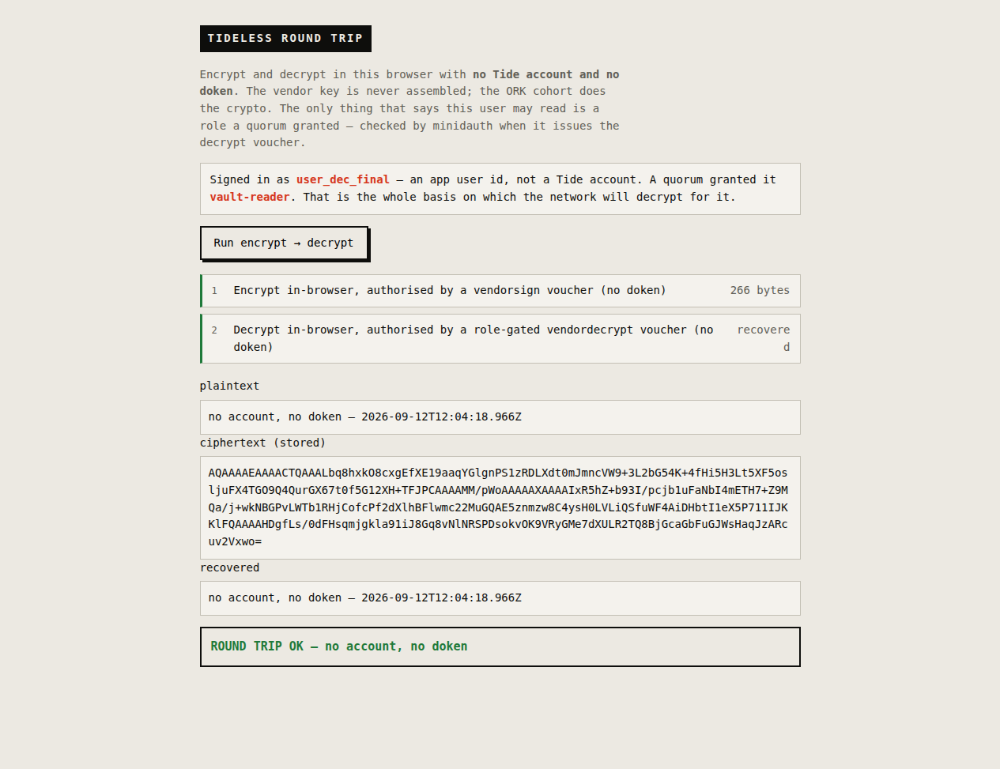

# tideless-web — a browser encrypting and decrypting with no Tide account

The same thing as [../tideless](../tideless), but in a real browser and click-through. A user with
**no Tide account and no doken** encrypts a value and reads it back; the ORK cohort does the crypto,
the vendor key is never assembled, and the only thing that lets this user read is a role a quorum
granted.



## The split that makes it safe

The browser runs the threshold crypto (via the published `@tideorg/js`, loaded from esm.sh), but it
never holds a credential and cannot ask to read as someone else. A tiny [server](server.mjs) does
two things the browser must not:

- **it knows who the user is** — here a fixed `DEMO_UID` standing in for your logged-in user — and
- **it proxies the two vouchers** to minidauth with the app token, injecting that uid and role on the
  decrypt side.

So the decrypt voucher is gated on the server's idea of who is calling, not the browser's. The page
gets vouchers and public policy bytes, nothing else.

| browser → server | server → minidauth |
|---|---|
| `POST /api/voucher/sign` | `POST /tide/vouchers` (encrypt / `vendorsign`) |
| `POST /api/voucher/decrypt` | `POST /vault/voucher` `{uid, role, …}` (role-gated `vendordecrypt`) |
| `GET /api/config` | enclave config + encrypt/decrypt policy bytes |

In a real app, replace `DEMO_UID` with the user id from your own login (a Clerk uid, say) after you
verify their session — exactly as the other examples read the user before calling minidauth.

## Run it

Needs minidauth up with a vendor key, an encrypt policy, and a **PUBLIC** decrypt policy (so a voucher,
not a doken, gates the read — see the [operator guide](../../docs/running.md)), and a tideless role
granted to the demo user through the quorum:

```sh
curl -sX POST localhost:8081/iga/change-requests/role -H "Authorization: Bearer $ALICE" \
  -H 'Content-Type: application/json' -d '{"vuid":"user_123","role":"vault-reader","tideless":true}'
# $BOB and $CAROL authorize, then commit — same as any governed change
```

Then:

```sh
DEMO_UID=user_123 DEMO_ROLE=vault-reader APP_TOKEN=<relying-party token> \
  MINIDAUTH_URL=http://localhost:8081 PORT=3010 node server.mjs
# open http://localhost:3010 and click "Run encrypt → decrypt"
```

No build step: the page loads `@tideorg/js@0.14.25` from esm.sh, which is built for the 14-of-20
network. The doken-less path uses the SDK's existing gSessKey mode, reached with a small guest-doken
stub (`serialize()` → `""`); a first-class guest flow upstream would replace it.

## What you will see, and the honest edge

Encrypt, then decrypt, then `ROUND TRIP OK — no account, no doken`. The browser console will show a
few `500`s from individual ORKs — those are the ones that do not hold the custom contract yet, and the
flow simply proceeds with the ones that do (any set ≥ threshold works). The trade this whole mode
makes is the one spelled out in [../tideless](../tideless#the-trade-you-are-making): minidauth is the
authority for these users' reads, deciding from a quorum-approved record rather than the cohort
checking a doken.
