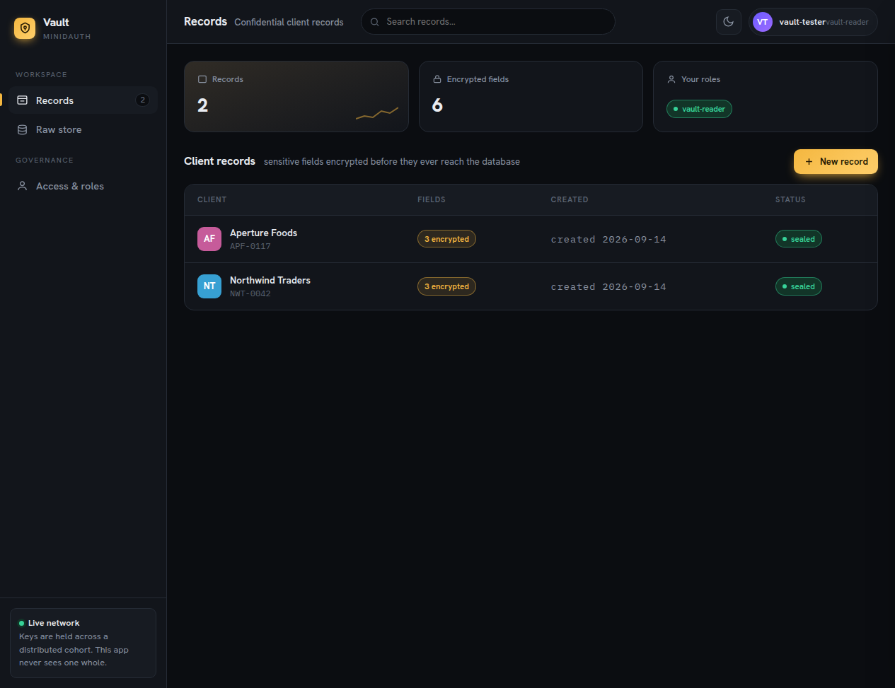
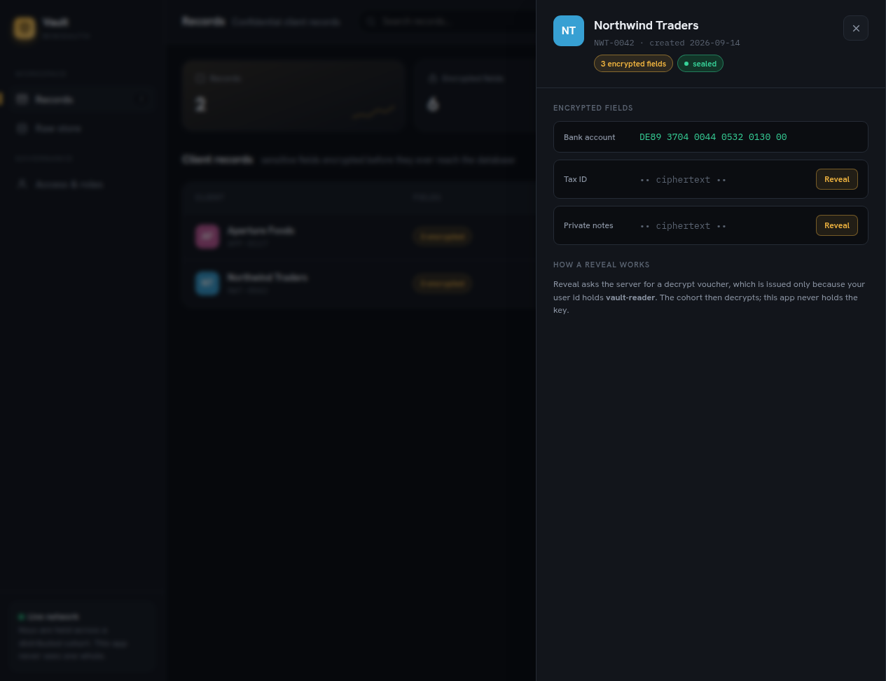
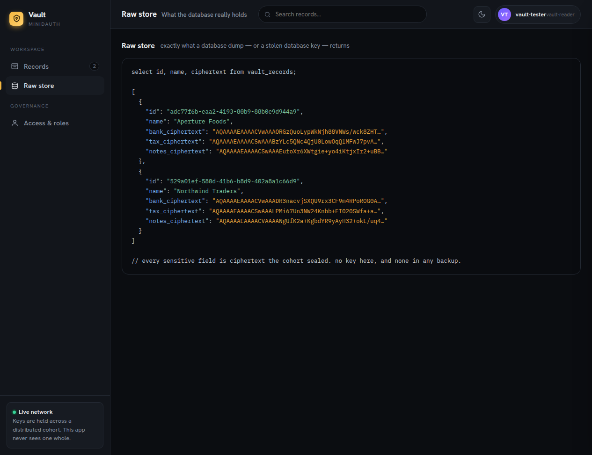

# Vault — a confidential records desk on Supabase + minidauth

A small firm's client vault. Staff sign in; sensitive fields (bank, tax id, private notes) are
**sealed in the browser before they ever reach the database**, and revealed only for a user whose id
holds a quorum-granted role.

It is **tideless**: no second login, no separate account, no doken. The signed-in user id is the
subject, and a role a quorum granted it is the gate.



| | |
|---|---|
| Reveal a field |  |
| What the database actually holds |  |

## What it shows

- **Encrypted at rest, for real.** Every sensitive field is ciphertext the cohort sealed. The *Raw
  store* view is exactly what a `pg_dump` or a stolen database key returns: no plaintext, and no key
  anywhere to make it readable.
- **Reads gated by a quorum-granted role, not by the app.** Revealing a field asks the server for a
  decrypt voucher, issued only if the signed-in user's id holds `vault-reader` — a role a quorum
  granted. The app cannot grant itself one.
- **No second login.** All of it runs off the app's own session; the browser holds no extra
  credential.

## Security posture

This example is written to be run in production, not just demoed:

- **Session in httpOnly cookies.** Sign-in happens on the server; the access and refresh tokens are
  set as `httpOnly`, `SameSite=Lax` cookies the page's scripts can never read, so an XSS cannot lift
  the session. The access token is **refreshed transparently** from the refresh cookie when it
  expires. Set `COOKIE_SECURE=true` (or `NODE_ENV=production`) behind TLS so the cookies are `Secure`.
- **CSRF on every state change.** A double-submit token: the server sets a readable `vault_csrf`
  cookie and requires a matching `X-CSRF-Token` header on every `POST`. A cross-site page cannot read
  the cookie to forge the header.
- **Locked-down headers.** A strict Content-Security-Policy (own origin, the crypto SDK, fonts, and
  the ORK network — nothing else), `X-Frame-Options: DENY`, `nosniff`, a referrer policy, and HSTS
  when secure.
- **Rate limiting** on sign-in and on the voucher endpoints (in-memory; put a shared store in front
  when you run more than one instance).
- **Server-to-service auth.** In production, authenticate to minidauth with a **signing-key
  assertion** (`MINIDAUTH_CLIENT_NAME` + `MINIDAUTH_CLIENT_KEY`) over TLS rather than the shared
  bearer token — see [`../shared/minidauth.js`](../shared/minidauth.js).

There is **no demo mode**: with nothing configured the app refuses to start, and until you are signed
in it shows only a sign-in gate.

Its data model is a **shared firm vault** by design — any signed-in user lists the record set and,
if they hold `vault-reader`, can decrypt it. If you need per-user confidentiality instead, scope the
queries to `created_by` (and add row-level-security policies keyed on the user).

## How the crypto works (no doken)

The browser runs the real crypto flows (`@tideorg/js`) with a **guest session key** instead of a
doken — the flows fall back to a plain `gSessKey` when no token is present. What authorises each
operation is a **voucher**, and the server issues vouchers through
[`../shared/minidauth.js`](../shared/minidauth.js):

| browser → server | server → minidauth | gate |
|---|---|---|
| `/api/vault/voucher/sign` | `POST /tide/vouchers` | any signed-in user may seal a field |
| `/api/vault/voucher/decrypt` | `POST /vault/voucher {uid, role}` | **the user's id must hold the role** |

The uid on the decrypt side is taken from the verified server session, never from the browser, so a
page cannot voucher a read for another user. See [examples/tideless](../tideless) for the bare round
trip and its trade-off (minidauth becomes the read authority for these users).

## Run it

Needs minidauth up with a vendor key, an encrypt policy, and a **PUBLIC** decrypt policy
(voucher-gated; see [docs/running.md](../../docs/running.md)).

1. **Database.** Create a Supabase project, run [`schema.sql`](schema.sql) in the SQL editor, and
   grant your user id the role through the quorum:

   ```sh
   curl -sX POST localhost:8081/iga/change-requests/role -H "Authorization: Bearer $ALICE" \
     -H 'Content-Type: application/json' -d '{"vuid":"<your user id>","role":"vault-reader","tideless":true}'
   # $BOB and $CAROL authorize, then commit
   ```

2. **Configure and start.**

   ```sh
   npm install
   cat > .env <<'EOF'
   SUPABASE_URL=https://<project>.supabase.co
   SUPABASE_ANON_KEY=<publishable key>
   SUPABASE_SERVICE_ROLE_KEY=<secret key>
   MINIDAUTH_URL=https://minidauth.internal        # TLS in production
   # production server-to-service auth (preferred over a shared token):
   # MINIDAUTH_CLIENT_NAME=vault
   # MINIDAUTH_CLIENT_KEY=<base64 pkcs8 ed25519 private key>
   MINIDAUTH_TOKEN=<relying-party token>           # dev fallback
   VAULT_ROLE=vault-reader
   # NODE_ENV=production        # or COOKIE_SECURE=true, behind TLS
   # TRUST_PROXY=1              # when behind a TLS-terminating proxy
   EOF
   npm start          # http://localhost:3007
   ```

## Environment

| variable | required | purpose |
|---|---|---|
| `SUPABASE_URL`, `SUPABASE_ANON_KEY`, `SUPABASE_SERVICE_ROLE_KEY` | yes | auth (anon) and storage (service role, server-only) |
| `MINIDAUTH_URL` | yes | where minidauth is reached |
| `MINIDAUTH_CLIENT_NAME` + `MINIDAUTH_CLIENT_KEY` | prod | signing-key assertion to minidauth |
| `MINIDAUTH_TOKEN` | dev | shared bearer token, if not using the assertion |
| `VAULT_ROLE` | no | the role that gates decrypt (default `vault-reader`) |
| `COOKIE_SECURE` | prod | `true` to set `Secure` cookies (default: on when `NODE_ENV=production`) |
| `TRUST_PROXY` | prod | hop count to trust when behind a proxy |
| `PORT` | no | default `3007` |
